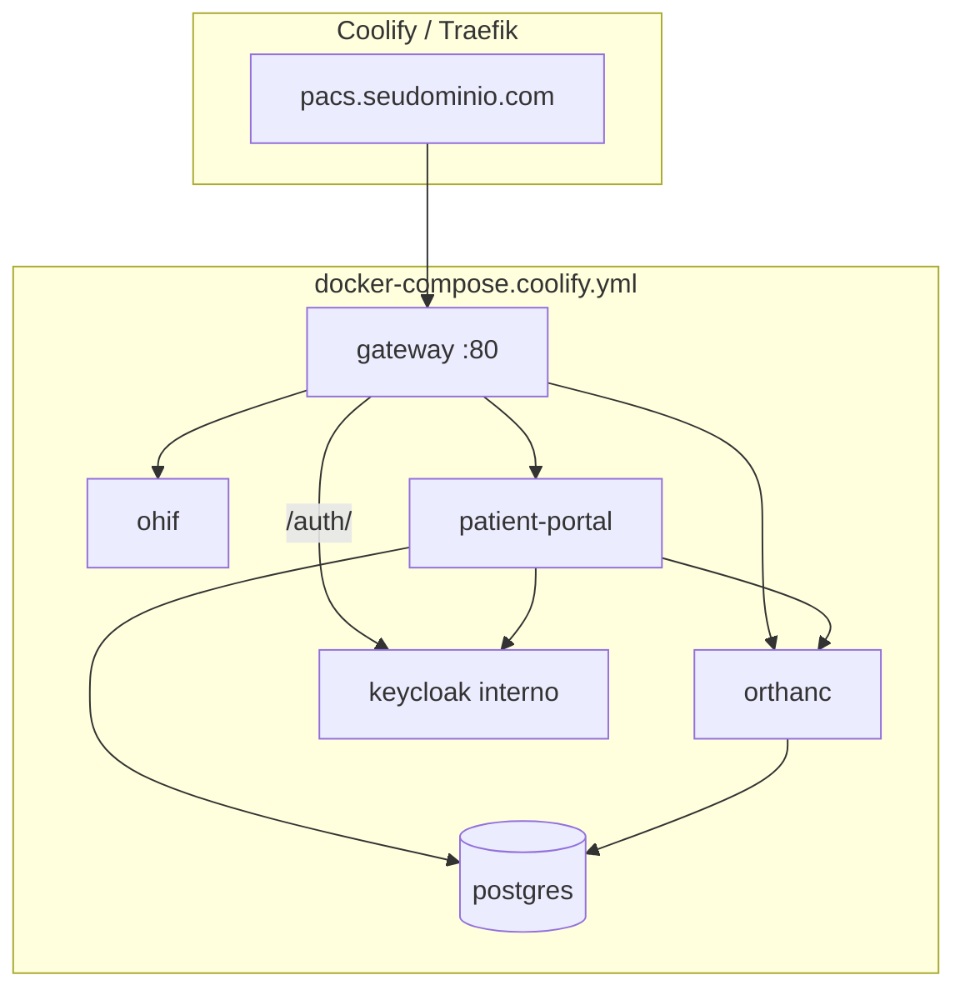

# Deploy no Coolify — LEX PACS

Guia para publicar o stack completo (gateway, viewer, portal, Orthanc, PostgreSQL, Keycloak) via **Docker Compose** no [Coolify](https://coolify.io).

---

## Visão geral

**Um único domínio público.** O Keycloak roda na rede interna do Docker e é exposto pelo gateway em `/auth/` — não é necessário (nem recomendado) um segundo domínio no Coolify.



| Serviço | Público no Coolify? | Porta |
|---------|---------------------|-------|
| **gateway** | Sim — domínio principal (`https://pacs...`) | 80 |
| keycloak | Não — proxy interno via gateway `/auth/` | 8080 (rede Docker) |
| ohif, patient-portal, orthanc, postgres | Não (rede interna) | — |
| orthanc DICOM | Opcional — TCP `4242` no host | 4242 |

**URLs OIDC:**

| Uso | Valor |
|-----|-------|
| Browser / redirects | `https://pacs.seudominio.com/auth/realms/lex-pacs` |
| Portal → Keycloak (rede Docker) | `http://keycloak:8080/auth/realms/lex-pacs` |
| Admin Keycloak | `https://pacs.seudominio.com/auth/admin` |

---

## 1. Preparar o repositório

Arquivos relevantes:

| Arquivo | Função |
|---------|--------|
| `docker-compose.coolify.yml` | Stack completo (fonte de verdade no Coolify) |
| `.env.coolify.example` | Modelo de variáveis |
| `scripts/validate-coolify-env.sh` | Valida segredos antes do deploy |

```bash
cp .env.coolify.example .env.coolify
# Edite URLs e segredos
./scripts/validate-coolify-env.sh
```

---

## 2. Criar recurso no Coolify

1. **+ Add Resource** → **Docker Compose** → conectar repositório GitHub
2. **Base Directory:** `/` (raiz do repo)
3. **Docker Compose file:** `docker-compose.coolify.yml`
4. **Build Pack:** Docker Compose (build automático das imagens `ohif` and `patient-portal`)

### Domínio (apenas um)

| Serviço | Domínio exemplo | HTTPS |
|---------|-----------------|-------|
| `gateway` | `pacs.hospital.com` | Ativado (Let's Encrypt) |

**Não** atribua domínio ao serviço `keycloak`. Ele fica acessível só via `https://pacs.hospital.com/auth/`.

### Variáveis de ambiente (aba Environment)

Copie de `.env.coolify.example`. **Obrigatórias:**

| Variável | Exemplo |
|----------|---------|
| `OHIF_VIEWER_URL` | `https://pacs.hospital.com` |
| `PORTAL_JWT_SECRET` | segredo ≥ 32 chars |
| `POSTGRES_PASSWORD` | senha forte |
| `KEYCLOAK_ADMIN_PASSWORD` | senha forte |
| `OIDC_CLIENT_SECRET` | mesmo valor do client Keycloak |
| `COOKIE_SECURE` | `true` |

**Opcionais** (derivadas automaticamente se omitidas):

| Variável | Padrão |
|----------|--------|
| `OIDC_PUBLIC_ISSUER_URL` | `${OHIF_VIEWER_URL}/auth/realms/lex-pacs` |
| `OIDC_ISSUER_URL` | `http://keycloak:8080/auth/realms/lex-pacs` |
| `KEYCLOAK_HTTP_RELATIVE_PATH` | `/auth` |

**Dica Coolify:** defina cada variável **no compose** (`${NOME}`) e preencha o valor na UI. Se usar remapeamento (`OHIF_VIEWER_URL=${SERVICE_FQDN_GATEWAY}`), desative **Inject** para essa variável na UI.

---

## 3. Deploy

1. **Deploy** no Coolify
2. Aguarde healthchecks (Keycloak ~1–2 min na 1ª vez)
3. Acesse `https://pacs.hospital.com/clinica/login`
4. Login OIDC ou bootstrap local (se habilitado)

### Verificação pós-deploy

```bash
curl -fsS https://pacs.hospital.com/clinica/login | head
curl -fsS https://pacs.hospital.com/auth/realms/lex-pacs/.well-known/openid-configuration | head
```

No servidor (SSH):

```bash
docker compose -f docker-compose.coolify.yml ps
```

---

## 4. Auth clínica

### Produção (recomendado)

```env
OIDC_ENABLED=true
CLINICAL_LOCAL_AUTH_ENABLED=false
```

Usuários de demo importados no realm (altere senhas no Keycloak Admin):

| Usuário | Grupo | Senha inicial |
|---------|-------|---------------|
| `radiologista` | radiologista | `lexrad2024` |
| `tecnico` | tecnico | `lextec2024` |
| `admin` | admin | `lexadmin2024` |

Admin Keycloak: `https://pacs.hospital.com/auth/admin` (usuário `KEYCLOAK_ADMIN`).

### Fallback htpasswd (emergência / dev)

```env
CLINICAL_LOCAL_AUTH_ENABLED=true
CLINICAL_BOOTSTRAP_USER=clinica
CLINICAL_BOOTSTRAP_PASSWORD=senha-forte
```

O portal cria `/etc/lex-pacs/htpasswd` no volume `clinical-htpasswd` na primeira subida.

---

## 5. DICOM (modalidades)

Porta **4242** exposta via `DICOM_PORT` (padrão `4242`). No firewall:

- Liberar **4242/TCP** apenas para IPs das modalidades
- **Não** expor Orthanc HTTP (8042) — já omitido no compose Coolify

---

## 6. Volumes persistentes

Coolify mantém estes volumes entre redeploys:

| Volume | Dados |
|--------|-------|
| `postgres-data` | Índice Orthanc + MWL SQL |
| `orthanc-storage` | Imagens DICOM |
| `lex-reports` | Laudos |
| `lex-audit` | Auditoria |
| `clinical-htpasswd` | Credenciais locais (se usadas) |
| `keycloak-import` | Realm renderizado |

Backup: ver [BACKUP.md](./BACKUP.md). Job automático com `docker.sock` **não** está no compose Coolify — use backup manual ou cron no host.

---

## 7. Atualizações (CI/CD)

1. Push no GitHub (`main`)
2. Coolify **Redeploy** (ou webhook automático)
3. Imagens `ohif` e `patient-portal` rebuildadas com `LEX_PACS_VERSION`
4. Smoke local antes: `./ohif-viewer/scripts/smoke-test.sh`

Rollback: redeploy commit anterior no Coolify (volumes intactos).

---

## 8. Troubleshooting

| Sintoma | Causa provável | Ação |
|---------|----------------|------|
| OIDC redirect errado | `OHIF_VIEWER_URL` incorreta | Conferir URL exata com HTTPS, sem barra final |
| Keycloak 502 em `/auth/` | Realm ainda importando | Aguardar healthcheck; ver logs `keycloak` |
| Login 401 após OIDC | `OIDC_CLIENT_SECRET` divergente | Igualar secret no Coolify e realm |
| Cookie não persiste | `COOKIE_SECURE=true` sem HTTPS | Ativar TLS no Coolify |
| Modalidade não envia | Firewall 4242 | Abrir porta para IP da modalidade |
| Issuer OIDC errado | `OIDC_PUBLIC_ISSUER_URL` manual desatualizada | Omitir variável (usa `${OHIF_VIEWER_URL}/auth/realms/lex-pacs`) |

Logs:

```bash
docker logs lex-pacs-gateway-1 --tail 100
docker logs lex-pacs-patient-portal-1 --tail 100
docker logs lex-pacs-keycloak-1 --tail 100
```

---

## 9. Desenvolvimento local (mesmo compose)

```bash
cp .env.coolify.example .env.coolify
# Ajuste para http://localhost:3000 (sem HTTPS)
docker compose -f docker-compose.coolify.yml \
  -f docker-compose.coolify.local.yml \
  --env-file .env.coolify up -d --build
```

Keycloak local: `http://localhost:3000/auth/` (via gateway, não porta separada).

Stack de dev alternativo (`ohif-viewer/docker-compose.yml`) usa o mesmo padrão `/auth/`.

---

## O que ainda falta para go-live no Coolify

| Item | Status |
|------|--------|
| Compose + um domínio + Keycloak interno | Feito |
| Push GitHub + tag release | Pendente (auth git) |
| Deploy real no Coolify + smoke remoto | Pendente |
| Backup automático no host (sem `docker.sock`) | Pendente — ver [BACKUP.md](./BACKUP.md) |
| Keycloak `start` + Postgres dedicado (vs `start-dev`) | Recomendado pós-MVP |
| Trocar senhas demo do realm | Obrigatório antes de produção |

---

## Referências

- [BACKUP.md](./BACKUP.md)
- [UPGRADE.md](./UPGRADE.md)
- [MANUAL-LEX-PACS.md](./MANUAL-LEX-PACS.md)
- [Coolify — Docker Compose](https://coolify.io/docs/knowledge-base/docker/compose)
