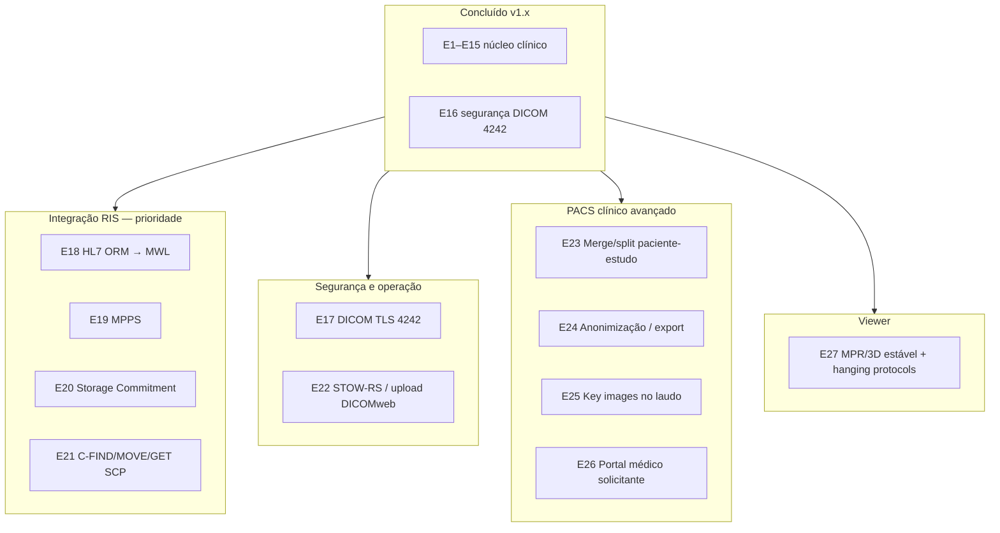

# Roadmap PACS — paridade de mercado (integração, não RIS)

**Posicionamento:** LEX PACS é um **PACS web self-hosted** que se integra a RIS/HIS existentes — **não substitui** agenda, faturamento ou cadastro administrativo.

**Referência de mercado:** núcleo [Animati PACS](https://www.animati.com.br/animatipacs/) (visualização, MWL, laudo, portal, interoperabilidade DICOM) — **sem** netRIS.

**Documentos relacionados:** [ROADMAP.md](./ROADMAP.md) · [MANUAL-LEX-PACS.md](./MANUAL-LEX-PACS.md) · [REDE-DOCKER.md](./REDE-DOCKER.md)

---

## Legenda de status

| Status | Significado |
|--------|-------------|
| **Concluído** | Entregue e com smoke test |
| **Em curso** | Implementação iniciada nesta release |
| **Planejado** | Próximas versões |
| **Futuro** | Paridade avançada / hospital grande |

---

## Mapa por camada

---

## Fase F — Segurança DICOM (porta 4242)

### E16 — Whitelist de modalidades + verificação AE/host ✅

**Entrega (v0.8)**

- `DicomAlwaysAllowStore/Echo/Find: false` — só equipamentos cadastrados
- `DicomCheckCalledAet: true` — modalidade deve chamar o AE do PACS
- `DicomCheckModalityHost: true` — IP deve bater com cadastro
- UI Admin → aba Servidor (toggles) + aviso se restrito sem equipamentos
- Migração automática de configs antigas sem essas chaves

**Teste:** `./ohif-viewer/scripts/smoke-test.sh E16`

**Configurar modalidade:** AE Title + IP na aba **Equipamentos**; Called AE = AE do PACS (`LEXPACS` ou o definido).

---

### E18 — HL7 ORM → MWL ✅

**Entrega (v0.9)**

- Listener **MLLP** no portal (porta **2575**, rede Docker / firewall)
- Parse **ORM^O01** (NW/XO/CA…) → tabela `lex_mwl_schedule`
- Sync automático para arquivos `.wl` (Orthanc MWL SCP)
- Mapeamento **modality → station AE** via equipamentos cadastrados
- API admin: `GET/PUT /clinica-api/admin/pacs/hl7/*`, `POST .../hl7/test`
- Script: `./scripts/hl7-send-orm.sh`

**Configurar RIS:** aponte o destino HL7 para `portal:2575` (rede Docker) ou IP do host com porta publicada.

**Teste:** `./ohif-viewer/scripts/smoke-test.sh E18`

---

### E17 — DICOM TLS na porta 4242

**Entrega planejada**

- Certificados TLS para DIMSE (Orthanc `DicomTlsEnabled`)
- UI ou script para upload de cert + CA
- Documentação de perfil com modalidades (TLS 1.2+)

**Critério de aceite**

- [ ] C-STORE com TLS entre modalidade de teste e PACS
- [ ] Fallback documentado para redes legadas sem TLS

**Prioridade:** Alta (hospitais) · **Esforço:** Médio

---

## Fase G — Integração com RIS existente

Objetivo: o RIS continua dono de agenda/cadastro; o LEX PACS recebe ordem, imagens e devolve status/laudo.

| ID | Entrega | Padrão / perfil | Prioridade |
|----|---------|-----------------|------------|
| **E18** | **HL7 v2 ORM → MWL** | ORM^O01 → entrada MWL (alternativa ao sync SQL) | **Concluído** |
| **E18b** | HL7 ADT (paciente) | Atualização demográfica no índice | Média |
| **E19** | **MPPS** (Modality Performed Procedure Step) | N-CREATE/N-SET — RIS marca exame realizado | **Alta** |
| **E20** | **Storage Commitment** | N-ACTION / N-EVENT-REPORT pós C-STORE | Média |
| **E21** | **Query/Retrieve DIMSE** | C-FIND / C-MOVE / C-GET SCP documentado | **Alta** |
| **E21b** | STOW-RS | Upload DICOM via DICOMweb (integradores) | Média |
| **E21c** | WADO-RS externo autenticado | Token/API para viewer de terceiros | Média |

**Já temos (base de integração):**

- MWL SCP (plugin Orthanc) + sync SQL ← RIS grava tabela `lex_mwl_schedule`
- DICOMweb/WADO via gateway autenticado
- Cadastro de equipamentos → `DicomModalities`

**E18 detalhe:** serviço `hl7-gateway` (MLLP) que parseia ORM e insere/atualiza fila MWL — desacopla de “SQL direto no banco do RIS”.

---

## Fase H — Governança de imagens (PACS maduro)

| ID | Entrega | Animati / mercado | Prioridade |
|----|---------|-------------------|------------|
| **E22** | Política de retenção por modalidade | Archive tier, purge | Média |
| **E23** | Merge / split / reconcile paciente-estudo | Correção pós-RIS | **Alta** |
| **E24** | Anonimização / pseudonimização (export) | Pesquisa, compartilhamento | Média |
| **E25** | Rejeição de instância (IHE RAD) | QA de imagem | Baixa |
| **E26** | Forwarding / roteamento para segundo PACS | Disaster recovery | Baixa |
| **E27** | Verificação de integridade (checksum) | Auditoria storage | Baixa |

---

## Fase I — Laudo e entrega (PACS, não RIS)

| ID | Entrega | Status |
|----|---------|--------|
| E9–E12 | Laudo rich text, PDF, assinatura, portal paciente | **Concluído** |
| **E28** | Templates de laudo por modalidade | Planejado |
| **E29** | Key images / imagens-chave no laudo PDF | Planejado |
| **E30** | Portal **médico solicitante** (protocolo + laudo, sem worklist) | Planejado |
| **E31** | Notificação paciente (e-mail/SMS) ao liberar laudo | Planejado |
| **E32** | Assinatura ICP-Brasil (opcional legal) | Futuro |

---

## Fase J — Viewer clínico (paridade Animati Workstation “light”)

| ID | Entrega | Prioridade |
|----|---------|------------|
| **E33** | WebGL/MPR/3D estável (fallback CPU documentado) | **Alta** |
| **E34** | Hanging protocols por modalidade | Média |
| **E35** | Comparativo temporal automático | Média |
| **E36** | PET-CT / fusão avançada | Futuro |
| **E37** | Mammography CAD SR / GSPS | Futuro |

OHIF cobre 2D e MPR básico; diferencial comercial está em estabilidade 3D e protocolos por modalidade.

---

## Fase K — Operação enterprise (sem virar RIS)

| ID | Entrega | Prioridade |
|----|---------|------------|
| **E38** | Multi-site / multi-AE (filiais) | Média |
| **E39** | Métricas Prometheus + alertas disco | Média |
| **E40** | Documentação IHE SWF/RID (checklist conformidade) | Baixa |
| **E41** | LGPD: trilha de exportação/exclusão paciente | Média |

---

## Releases sugeridas

| Versão | Conteúdo | Objetivo mercado |
|--------|----------|------------------|
| **v0.8** | E16 segurança DICOM 4242 | PACS “fechado” na rede clínica |
| **v0.9** | E18 HL7 ORM + E19 MPPS | Integração RIS padrão Brasil |
| **v1.0** | E17 TLS + E21 Q/R DIMSE | Hospital / telerradiologia |
| **v1.1** | E23 merge + E28 templates + E30 solicitante | Paridade fluxo clínico Animati PACS |
| **v1.2** | E33–E35 viewer avançado | Competir em qualidade diagnóstica web |

---

## Comparativo rápido: LEX vs Animati PACS (só PACS)

| Capacidade | Animati PACS | LEX hoje | Próximo ID |
|------------|--------------|----------|------------|
| C-STORE seguro (whitelist) | Sim | **E16 ✅** | — |
| MWL SCP | Sim | ✅ SQL + **HL7 ORM (E18)** | — |
| MPPS | Sim | **E19 ✅** | — |
| DICOMweb | Sim | ✅ | E21b STOW |
| Q/R DIMSE | Sim | **E21 ✅** | — |
| DICOM TLS | Sim | ❌ | E17 |
| Laudo + portal paciente | Sim | ✅ | E28 templates |
| Portal solicitante | Sim | ❌ | E30 |
| Workstation 3D | Sim (produto à parte) | ⚠️ OHIF | E33 |
| IA / voz | Sim | ❌ (fora escopo PACS core) | — |
| RIS / faturamento | netRIS | **Fora de escopo** | — |

---

## Critérios de “PACS integrável pronto para CDI”

Checklist mínimo antes de comparar feature-by-feature com Animati PACS:

- [x] E16 — 4242 restrita a equipamentos cadastrados
- [x] E18 — HL7 ORM (MLLP 2575) ou integração MWL certificada com 1 RIS parceiro
- [x] E19 — MPPS para fechar loop “exame realizado”
- [x] E21 — C-FIND/C-MOVE/C-GET SCP documentado + smoke DIMSE
- [ ] E17 — DICOM TLS (se cliente hospitalar)
- [ ] E23 — merge paciente (suporte operacional)

---

## Controle de progresso

| ID | Status | Versão alvo | Notas |
|----|--------|-------------|-------|
| E16 | **Concluído** | 0.8 | Segurança DICOM 4242 |
| E18 | **Concluído** | 0.9 | HL7 ORM → MWL (MLLP 2575) |
| E17 | Planejado | 1.0 | DICOM TLS |
| E19 | **Concluído** | 0.9 | MPPS SCP porta 4243 |
| E20 | Planejado | 1.0 | Storage Commitment |
| E21 | **Concluído** | 1.0 | Q/R DIMSE + painel Integração |
| E22 | Planejado | 1.0 | STOW-RS |
| E23 | Planejado | 1.1 | Merge/reconcile |
| E28 | Planejado | 1.1 | Templates laudo |
| E30 | Planejado | 1.1 | Portal solicitante |
| E33 | Planejado | 1.2 | Viewer 3D/MPR |

---

*Atualize esta tabela ao concluir cada etapa. Smoke tests: [TESTES.md](./TESTES.md).*
