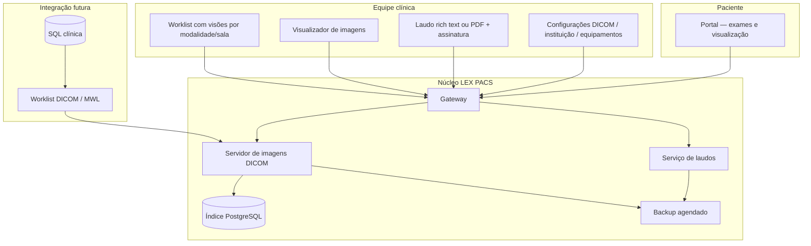

# LEX PACS — Roadmap de produto

**Versão:** 1.0  
**Última atualização:** junho/2026  
**Objetivo:** evoluir o LEX PACS em etapas **testáveis**, com **backup simples** e **atualização de versão previsível**, até um PACS clínico completo com **laudo** (rich text + assinatura ou PDF anexo).

**Documentos relacionados**

| Documento | Conteúdo |
|-----------|----------|
| [MANUAL-LEX-PACS.md](./MANUAL-LEX-PACS.md) | Operação, arquitetura, segurança |
| [TESTES.md](./TESTES.md) | **Smoke tests e checklist por etapa** |
| [UPGRADE.md](./UPGRADE.md) | **Runbook de upgrade e rollback** |
| [../ohif-viewer/.env.example](../ohif-viewer/.env.example) | Variáveis de ambiente |

---

## Princípios de engenharia

1. **Uma etapa, um teste** — nada avança sem critérios de aceite verdes. Ver [TESTES.md](./TESTES.md) e `./ohif-viewer/scripts/smoke-test.sh`.
2. **Volumes explícitos** — imagens DICOM, laudos, config e índice em discos/volumes distintos para backup e restore.
3. **Gateway único** — usuários só enxergam a porta 3000 (HTTPS em produção).
4. **White-label** — interfaces expostas só mostram **LEX PACS**.
5. **Upgrade reversível** — imagens Docker versionadas; dados em volumes; migração documentada por etapa.
6. **Configuração na UI** — preferir telas clínicas em vez de editar JSON manualmente.

---

## Estado atual (concluído)

| ID | Entrega | Teste rápido |
|----|---------|--------------|
| **E1** | Portal do paciente (login ID + nascimento, lista de exames) | `http://localhost:3000/paciente/` |
| **E2** | Gateway unificado + auth clínica + cookie temporário no viewer | Worklist exige login; paciente abre só o exame dele |
| **E2b** | Tema LEX PACS (visualizador + portal) | Sem marcas de terceiros na UI |
| **E2c** | AE Title editável na worklist (Configurações DICOM) | Salvar → `/system` reflete novo AET |
| **E2d** | API clínica `/clinica-api/` | 401 sem auth; 200 com credenciais |
| **E5** | Backup manual de volumes + manifest | `./scripts/backup-volumes.sh` |
| **E6** | Upgrade com tags fixas + runbook | `./scripts/upgrade.sh` / `docs/UPGRADE.md` |
| **E3** | PostgreSQL + orthanc-storage | `./scripts/migrate-e3.sh` |
| **E4** | Compressão JPEG-LS na ingestão | `IngestTranscoding` no Orthanc |
| **E7** | Config DICOM (servidor, equipamentos, visões) | Modal Configurações DICOM |
| **E8** | Presets worklist + `?view=` | Barra de visões na worklist |
| **E9–E11** | Laudos (rascunho, PDF, assinatura) | Painel Laudo no viewer |
| **E12** | Laudo liberado no portal do paciente | Botão **Ver laudo** após liberação clínica |
| **E13** | MWL DICOM + sync SQL | `./scripts/smoke-test.sh E13` |
| **E14** | SSO OIDC (Keycloak) + Basic em transição | Token Bearer na API clínica |
| **E15** | Auditoria estruturada | `GET /clinica-api/admin/pacs/audit` |

### Pós-roadmap (ondas de polish)

| Onda | Entrega | Teste |
|------|---------|-------|
| **A** | Aba Admin (status/sync MWL, auditoria, logout clínico, sync automático) | `./scripts/smoke-test.sh` (seção Onda A) |
| **B** | Formulário config SQL MWL na aba Admin | `./scripts/smoke-test.sh` (seção Onda B) |
| **B+** | Estatísticas admin (exames, pacientes, modalidade, idade, disco) | `GET /clinica-api/admin/pacs/stats` |

---

## Visão do produto final



---

## Mapa de etapas

| Fase | ID | Nome | Depende de | Status |
|------|-----|------|------------|--------|
| **A — Operação** | E3 | Volumes separados + PostgreSQL (índice) | E2 | **Concluído** |
| | E4 | Compressão lossless na ingestão | E3 | **Concluído** |
| | E5 | Backup e restore documentado + job automático | E3 | **Parcial** (script manual) |
| | E6 | Upgrade de versão (runbook + tags de imagem) | E5 | **Concluído** |
| **B — Configuração clínica** | E7 | Configurações DICOM ampliadas | E2c | **Concluído** |
| | E8 | Visões de worklist (RX sala 1/2, CT, MR…) | E2 | **Concluído** |
| **C — Laudos** | E9 | Laudo rich text + rascunho | E2, E5* | **Concluído** |
| | E10 | Upload PDF anexo ao exame | E9 | **Concluído** |
| | E11 | Assinatura e trava do laudo | E9 | **Concluído** |
| | E12 | Laudo no portal do paciente (opcional) | E9, E1 | **Concluído** |
| **D — Integração** | E13 | MWL DICOM + sync SQL | E3, E7 | **Concluído** |
| | E14 | SSO clínico (OIDC) | E2 | **Concluído** |
| | E15 | Auditoria de acesso | E14 | **Concluído** |

\*E9 pode começar com volume de laudos próprio; E5 formaliza backup desse volume.

---

## Fase A — Operação, backup e upgrade

### E3 — Volumes separados + PostgreSQL

**Entrega**

- Volume `orthanc-storage` — arquivos DICOM.
- Volume `orthanc-index` — PostgreSQL (substitui SQLite embutido).
- Volume `orthanc-config` — config runtime (já existe).
- Volume `lex-reports` — laudos (HTML/PDF/metadados).
- `docker-compose.prod.yml` sem expor API 8042.

**Testes de aceite**

- [ ] Estudos existentes migrados ou reindexados.
- [ ] Portal + viewer continuam funcionando.
- [ ] `docker compose ps` healthy.

**Backup:** passa a incluir `orthanc-storage`, `postgres-data`, `orthanc-config`, `lex-reports`.

---

### E4 — Compressão lossless (ingestão)

**Entrega:** transcoding JPEG-LS (ou equivalente) no servidor de imagens na recepção C-STORE.

**Testes**

- [ ] Novo exame armazenado comprimido sem perda.
- [ ] Visualizador abre normalmente.

---

### E5 — Backup e restore

**Entrega**

- Serviço ou script `lex-pacs-backup` (cron configurável).
- Destino: pasta do host (`BACKUP_HOST_PATH`) ou NAS.
- Retenção configurável (ex.: 7 diários + 4 semanais).
- Script `scripts/restore-backup.sh` com ordem de volumes.
- Seção no manual: backup mínimo em 3 comandos.

**Estrutura de backup (padrão de mercado)**

```
backup/YYYY-MM-DD_HHMM/
├── orthanc-storage.tar.zst
├── postgres.dump
├── orthanc-config.tar.zst
├── lex-reports.tar.zst
├── gateway-htpasswd          # fora do git
└── manifest.json             # versões das imagens + checksums
```

**Testes**

- [ ] Backup completo em ambiente de teste.
- [ ] Restore em máquina limpa → worklist + laudo + imagens OK.

---

### E6 — Upgrade de versão do software

**Entrega**

- Imagens Docker com tag fixa (`lex-pacs/viewer:1.2.0`, não `latest`).
- Runbook `docs/UPGRADE.md`:
  1. Backup (E5).
  2. `docker compose pull` / build tag nova.
  3. Migrações de banco (se houver).
  4. Smoke test automatizado.
  5. Rollback: voltar tag + volumes intactos.

**Testes**

- [ ] Upgrade 1.x → 1.y em cópia dos dados.
- [ ] Rollback documentado executado uma vez.

---

## Fase B — Configuração clínica e worklist

### E7 — Configurações DICOM ampliadas

**Tela única com abas** (menu engrenagem na worklist)

| Aba | Campos |
|-----|--------|
| **Servidor** | AE Title ✓, nome da instituição, porta DICOM (com aviso), verificar AE chamado |
| **Equipamentos** | Lista modalidades: AE, IP, porta, descrição (RX sala 1, RX sala 2…) |
| **Worklist** | Visões salvas (ver E8) |

**Testes:** cada campo salva, persiste após reinício, modalidade consegue C-STORE após cadastro.

---

### E8 — Visões de worklist (modalidade / salas RX)

**Entrega**

- Presets: *Todos*, *RX Sala 1*, *RX Sala 2*, *CT*, *MR*, *US*.
- Filtro por modalidade, data, descrição.
- URL com `?view=rx-sala-1` para bookmark.
- Até MWL (E13): filtro por tag instituição / descrição / estação.

**Mercado:** uma worklist com visões; MWL filtra por **Scheduled Station AE Title** por equipamento.

**Testes**

- [ ] Cada visão mostra subconjunto correto.
- [ ] Alternar visão não quebra autenticação.

---

## Fase C — Laudos (fecha o produto clínico)

### E9 — Laudo em rich text (rascunho)

**Entrega**

- Painel **Laudo** no visualizador (estudo aberto).
- Editor rich text (negrito, itálico, listas, parágrafos).
- Salvar rascunho vinculado ao `StudyInstanceUID`.
- API `GET/PUT /clinica-api/reports/{study_uid}`.
- Armazenamento em volume `lex-reports` (JSON + HTML).

**Metadados do laudo**

```json
{
  "study_instance_uid": "1.2.3...",
  "patient_id": "...",
  "status": "draft | signed",
  "content_html": "<p>...</p>",
  "author_name": "",
  "created_at": "",
  "updated_at": ""
}
```

**Testes**

- [ ] Radiologista autenticado salva e reabre rascunho.
- [ ] Outro estudo não vê o laudo alheio.
- [ ] Backup inclui `lex-reports`.

---

### E10 — Upload de PDF anexo

**Entrega**

- Upload PDF no painel Laudo (multipart).
- Um PDF por estudo (substituir ou versionar — configurável; MVP: um ativo).
- Download pelo visualizador; metadado em `report.json` (`pdf_filename`, `pdf_sha256`).
- *Fase futura:* encapsular como DICOM PDF no servidor de imagens (interoperabilidade).

**Testes**

- [ ] Upload ≤ 20 MB; rejeitar não-PDF.
- [ ] PDF visível após reload.
- [ ] Incluído no backup.

---

### E11 — Assinatura do laudo

**Entrega**

- Botão **Assinar laudo** (rich text ou após PDF).
- Campos: nome do radiologista, CRM opcional, data/hora (servidor).
- Status `signed` → edição bloqueada (somente nova versão ou “adendo” — MVP: bloqueio total).
- Registro de auditoria mínimo em `report.json` (`signed_at`, `signed_by`).

**Mercado:** equivalente a “laudo definitivo”; adendo em fase posterior.

**Testes**

- [ ] Após assinar, PUT de conteúdo retorna 403.
- [ ] Assinatura visível no painel.
- [ ] PDF assinado digitalmente (ICP-Brasil) — **fora do MVP**; roadmap futuro E11b.

---

### E12 — Laudo no portal do paciente (opcional)

**Entrega:** paciente vê laudo liberado (flag `visible_to_patient`) — HTML renderizado ou link PDF.

**Testes:** só após liberação explícita na clínica; sem acesso a rascunho.

---

## Fase D — Integração e enterprise

### E13 — MWL + sync SQL

- Plugin worklist no servidor DICOM.
- Serviço sync SQL → fila por sala/modalidade.
- Admin de conexão SQL.

### E14 — SSO clínico (OIDC / Keycloak)

- Substituir HTTP Basic no gateway.
- Grupos: radiologista, técnico, admin.

### E15 — Auditoria

- Log estruturado: login, abertura de estudo, laudo assinado, exportação.

---

## Priorização de implementação (ondas)

| Onda | Etapas | Objetivo |
|------|--------|----------|
| **1** | **E9.1** → E10 → E11 | Fechar laudo clínico (MVP) |
| **2** | E5 → E6 | Backup, restore e upgrade |
| **3** | E3 → E4 | Produção robusta (PostgreSQL + compressão) |
| **4** | E7 → E8 | Configuração e worklist por sala/modalidade |
| **5** | E12 | Laudo no portal |
| **6** | E13 → E14 → E15 | Integração hospitalar |

**Por que laudo antes de PostgreSQL?** Entrega valor clínico imediato com volume dedicado; E3 migra laudos junto com o restante.

---

## Critérios de “release” por versão

| Versão | Conteúdo mínimo |
|--------|-----------------|
| **v0.3** | E9 + E10 + E11 (laudo completo MVP) | **E9 em andamento** |
| **v0.4** | E5 + E6 (backup/upgrade) |
| **v0.5** | E3 + E4 (produção storage) |
| **v0.6** | E7 + E8 (config + worklist views) |
| **v1.0** | E13 + E14 + E15 + E12 (integração + SSO + auditoria + paciente vê laudo) |

---

## Checklist de smoke test (rodar após cada etapa)

**Automatizado (recomendado):**

```bash
cd ohif-viewer
chmod +x scripts/smoke-test.sh   # uma vez
./scripts/smoke-test.sh          # todas as etapas concluídas
./scripts/smoke-test.sh E9       # só a etapa recém-implementada
```

Detalhes, checklist manual e fluxo: **[TESTES.md](./TESTES.md)**.

**Manual rápido:**

---

## Riscos e mitigação

| Risco | Mitigação |
|-------|-----------|
| Perda de dados no upgrade | E5 backup obrigatório antes de E6 |
| Laudo sem valor legal | MVP = assinatura lógica; ICP-Brasil em etapa futura |
| Dois RX na mesma worklist | E8 visões agora; E13 MWL depois |
| Volume de laudo fora do backup | E5 inclui `lex-reports` desde E9 |

---

## Controle de progresso

Atualize esta tabela ao concluir cada etapa:

| ID | Status | Data | Notas |
|----|--------|------|-------|
| E1 | Concluído | 2026-06 | Portal paciente |
| E2 | Concluído | 2026-06 | Gateway + auth |
| E2c | Concluído | 2026-06 | AE Title UI |
| E9 | Concluído (MVP) | 2026-06 | Painel Laudo + API + volume |
| E10 | Concluído (MVP) | 2026-06 | Upload PDF |
| E11 | Concluído (MVP) | 2026-06 | Assinatura lógica + bloqueio |
| E5 | Pendente (job automático) | Script manual OK |
| E3 | Concluído | 2026-06 | PostgreSQL + orthanc-storage |
| Onda A | Concluído | 2026-06 | Admin, logout, sync MWL |
| Onda B | Concluído | 2026-06 | Form SQL MWL na UI |

---

*Próximo passo de implementação: **E9.1** — API de laudos + volume `lex-reports` + painel básico no visualizador.*
